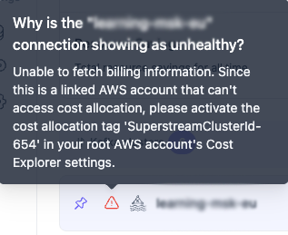

# Step 3: Connect a Cluster


**Prerequisites Checklist**

* [ ] The agent has been successfully deployed, and all pods are running in a healthy state.
* [ ] The required Kafka user has been successfully created with all required permissions.


### Step 1: Fill in cluster details

Each vendor has a slightly different connection approach

#### Confluent Cloud / AWS MSK

Automatic cluster discovery will initiate once an API key is provided.\
Metrics will be collected via the vendor API.

#### Aiven

You'll need an API token, Kafka cluster connection details, and the project and service names.

#### Redpanda / Apache (Self-hosted)

No automatic cluster discovery. Each cluster should be added manually. \
To enable metric collection in Superstream, a JMX connection must also be configured.


Superstream will ingest metrics from the `/metrics` endpoint, regardless of whether they are exposed by **Prometheus** exporters or directly from **JMX** sources.


To get Apache Kafka JMX port and token information, here are the key approaches:

<details>

<summary>Getting JMX Port</summary>

**1. Check Kafka Server Configuration**

* Look in your `server.properties` file for JMX-related settings
* Common JMX port configurations:

```bash
# Default JMX port is often 9999
export JMX_PORT=9999
# Or set via KAFKA_JMX_OPTS
export KAFKA_JMX_OPTS="-Dcom.sun.management.jmxremote.port=9999"
```

**2. Check Environment Variables**

```bash
echo $JMX_PORT
env | grep JMX
```

**3. Check Running Processes**

```bash
# Find Kafka process and check JMX arguments
ps aux | grep kafka
# Or use netstat to see what ports are listening
netstat -tlnp | grep java
```

**4. Check Startup Scripts**

* Look in `kafka-server-start.sh` or similar startup scripts
* Check for JMX\_PORT or KAFKA\_JMX\_OPTS variables


</details>

<details>

<summary>Getting JMX Token/Authentication</summary>

**1. Check JMX Security Configuration**

```bash
# Look for these JVM options in your Kafka startup
-Dcom.sun.management.jmxremote.authenticate=true
-Dcom.sun.management.jmxremote.password.file=/path/to/jmxremote.password
-Dcom.sun.management.jmxremote.access.file=/path/to/jmxremote.access
```

**2. Password File Location**

* Usually in `$KAFKA_HOME/config/` or `/etc/kafka/`
* Default filename: `jmxremote.password`
* Format: `username password`

**3. Access File Location**

* Usually alongside password file
* Default filename: `jmxremote.access`
* Format: `username readonly|readwrite`

</details>

<details>

<summary>Testing JMX Connection</summary>

<pre class="language-bash"><code class="lang-bash"><strong># Test connection with JConsole
</strong>jconsole localhost:9999

# Or use command line tools
jmxterm -l localhost:9999
</code></pre>

#### Common Default Locations

* **Confluent Platform**: JMX typically on port 9581-9585
* **Standard Kafka**: Often port 9999
* **Docker/Kubernetes**: Check container environment variables

If JMX isn't enabled, you'll need to configure it by adding the appropriate JMX options to your Kafka startup configuration.

</details>

<details>

<summary>Required JMX Rules/metrics</summary>



</details>

### Step 3: Verify that all discovered or added clusters are in a healthy state

When clusters are added or discovered, the system may surface warnings related to permissions or network connectivity. It’s recommended to resolve these promptly to ensure proper functionality.

<figure><figcaption></figcaption></figure>


[step-4-whats-next.md](step-4-whats-next.md)

