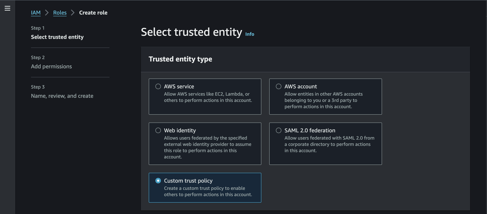

# Step 3: Connect Your Kafka Cluster/s

Option 1: Using Superstream Console

### Step 1: Login to [Superstream Console](https://app.superstrem.ai)

If this is your first login, please use the link included in your welcome email.

### Step 2: Add a new connection

In the upper-right corner, you will find this button:

### &#x20;

### Step 3: Fill in the details

<div align="left"><figure><figcaption></figcaption></figure></div>

Please do not close the window until a message is shown.

##

## Optional Add a vendor API key to gain deeper insights.

You can add an API key to gain deeper insights for eligible Kafka vendors such as Confluent, Aiven, Redpanda, and AWS.

Here's how to do it if you didn't set it up during the initial client connection establishment:

**Step 1:** Head over to Settings -> "[Keys](https://app.superstream.ai/keys)"

<figure><figcaption></figcaption></figure>

**Step 2:** Add new key:

<figure><figcaption></figcaption></figure>



For connecting Confluent Cloud clusters to Superstream, two types of API keys are required to be created:&#x20;

### Cluster connectivity key

#### Create one using Confluent Console:

1. Home -> Environments -> \<environment name> -> \<cluster name> -> API Keys

<figure><figcaption></figcaption></figure>

2.  Click on "+ Add key"

    <figure><figcaption></figcaption></figure>
3. In the opened walkthrough:
   1. Choose "**Service account**"
   2. "**Create a new one**" named `Superstream`
   3. Define the following rules:
      1. Cluster
         1. `ALTER_CONFIGS`: ALLOW
         2. `DESCRIBE`: ALLOW
         3. `DESCRIBE_CONFIGS`: ALLOW
      2. Consumer Group (For all "\*")
         1. LITERAL, DESCRIBE, ALLOW
         2. LITERAL, READ, ALLOW
   4. "Create" **and save the newly created creds**.
   5. Main menu -> Accounts & access -> Service accounts -> Superstream
      1.  Add the following role assignments:

          **For each designated organization:**

          * `BillingAdmin`

          **For each designated environment (Environment level):**

          * M`etricsViewer`
          * `DataDiscovery`
          * `Operator`

          **For each designated cluster (Cluster level):**

          * `CloudClusterAdmin`
      2. For each designated **cluster** -> **Topics**
         1. `DeveloperRead`: All topics
         2. `DeveloperManage`: All topics

### Kafka vendor API key

1. Head over to **Main menu** -> **API Keys** -> "**+ Add API key**" and perform the following:

<figure><figcaption></figcaption></figure>

***

<figure><figcaption></figcaption></figure>

***

<figure><figcaption></figcaption></figure>

***

<figure><figcaption></figcaption></figure>





For effective functioning, a user or token requires the following permissions:

* Cluster-level:
  * Describe all topics, List all topics, Describe configs, Describe cluster
* Topic-level:
  * Read: All topics
  * Alter: All topics
  * Delete: All topics
  * Describe: All topics
  * Alter: All topics
  * AlterConfigs: All topics
  * DescribeConfigs: All topics
  * <mark style="color:red;">**Read, Create, and Write: single topic named**</mark>**&#x20;`superstream.metadata`** (A dedicated Superstream topic with infinite retention and a single partition).
* Consumer group-level:
  * Describe
  * List Consumer Groups

ACL statement that grants `read` access to a user named Superstream for `all topics` in the Kafka cluster:


```bash
kafka-acls --bootstrap-server : -add --allow-principal User:Superstream --operation read --topic '' --group '' --command-config <PATH_TO_CRED_FILE>
```


ACL statement that grants `describe` access to a user named Superstream for `all topics` in the Kafka cluster:


```bash
kafka-acls --bootstrap-server : -add --allow-principal User:Superstream --operation Describe --topic '*' --command-config <PATH_TO_CRED_FILE>
```


ACL statement that grants `DescribeConfigs` access to a user named Superstream for `all topics` in the Kafka cluster:


```bash
kafka-acls --bootstrap-server <URL>:<PORT>  -add --allow-principal User:Superstream --operation DescribeConfigs --topic '*' --command-config <PATH_TO_CRED_FILE>
```




### Kafka vendor API key

#### Create a new Policy

Log in to the AWS Console and navigate to the **IAM** section to **create a new policy** with the permissions below:


```json
{
    "Version": "2012-10-17",
    "Statement": [
        {
            "Sid": "EC2VpcEndpoint1",
            "Effect": "Allow",
            "Action": "ec2:CreateVpcEndpoint",
            "Resource": "arn:*:ec2:*:*:vpc-endpoint/*",
            "Condition": {
                "StringEquals": {
                    "aws:RequestTag/AWSMSKManaged": "true"
                },
                "StringLike": {
                    "aws:RequestTag/ClusterArn": "*"
                }
            }
        },
        {
            "Sid": "EC2VpcEndpoint2",
            "Effect": "Allow",
            "Action": "ec2:CreateTags",
            "Resource": "arn:*:ec2:*:*:vpc-endpoint/*",
            "Condition": {
                "StringEquals": {
                    "ec2:CreateAction": "CreateVpcEndpoint"
                }
            }
        },
        {
            "Sid": "EC2VpcEndpoint3",
            "Effect": "Allow",
            "Action": "ec2:DeleteVpcEndpoints",
            "Resource": "arn:*:ec2:*:*:vpc-endpoint/*",
            "Condition": {
                "StringEquals": {
                    "ec2:ResourceTag/AWSMSKManaged": "true"
                },
                "StringLike": {
                    "ec2:ResourceTag/ClusterArn": "*"
                }
            }
        },
        {
            "Sid": "EC2VpcEndpoint4",
            "Effect": "Allow",
            "Action": "ec2:CreateVpcEndpoint",
            "Resource": [
                "arn:*:ec2:*:*:vpc/*",
                "arn:*:ec2:*:*:security-group/*",
                "arn:*:ec2:*:*:subnet/*"
            ]
        },
        {
            "Sid": "IAM1",
            "Effect": "Allow",
            "Action": "iam:PassRole",
            "Resource": "*",
            "Condition": {
                "StringEquals": {
                    "iam:PassedToService": "kafka.amazonaws.com"
                }
            }
        },
        {
            "Sid": "IAM2",
            "Effect": "Allow",
            "Action": "iam:CreateServiceLinkedRole",
            "Resource": "arn:aws:iam::*:role/aws-service-role/kafka.amazonaws.com/AWSServiceRoleForKafka*",
            "Condition": {
                "StringEquals": {
                    "iam:AWSServiceName": "kafka.amazonaws.com"
                }
            }
        },
        {
            "Sid": "IAM3",
            "Effect": "Allow",
            "Action": "iam:CreateServiceLinkedRole",
            "Resource": "arn:aws:iam::*:role/aws-service-role/delivery.logs.amazonaws.com/AWSServiceRoleForLogDelivery*",
            "Condition": {
                "StringEquals": {
                    "iam:AWSServiceName": "delivery.logs.amazonaws.com"
                }
            }
        },
        {
            "Sid": "Kafka",
            "Effect": "Allow",
            "Action": [
                "kafka:UpdateBrokerCount",
                "kafka:DescribeConfiguration",
                "kafka:ListScramSecrets",
                "kafka:ListKafkaVersions",
                "kafka:GetBootstrapBrokers",
                "kafka:ListClientVpcConnections",
                "kafka:UpdateBrokerType",
                "kafka:DescribeCluster",
                "kafka:ListClustersV2",
                "kafka:DescribeClusterOperation",
                "kafka:ListNodes",
                "kafka:ListClusterOperationsV2",
                "kafka:UpdateClusterConfiguration",
                "kafka:ListClusters",
                "kafka:GetClusterPolicy",
                "kafka:DescribeClusterOperationV2",
                "kafka:DescribeClusterV2",
                "kafka:ListReplicators",
                "kafka:ListConfigurationRevisions",
                "kafka:ListVpcConnections",
                "kafka:ListTagsForResource",
                "kafka:GetCompatibleKafkaVersions",
                "kafka:DescribeConfigurationRevision",
                "kafka:UpdateConfiguration",
                "kafka:ListConfigurations",
                "kafka:ListClusterOperations",
                "kafka:TagResource",
                "kafka:UntagResource",
                "kafka:DescribeVpcConnection",
                "kafka:DescribeReplicator"
            ],
            "Resource": "*"
        },
        {
            "Sid": "KafkaCluster",
            "Effect": "Allow",
            "Action": [
                "kafka-cluster:DescribeTransactionalId",
                "kafka-cluster:CreateTopic",
                "kafka-cluster:*Topic*",
                "kafka-cluster:AlterCluster",
                "kafka-cluster:Connect",
                "kafka-cluster:DeleteTopic",
                "kafka-cluster:ReadData",
                "kafka-cluster:DescribeTopicDynamicConfiguration",
                "kafka-cluster:AlterTopicDynamicConfiguration",
                "kafka-cluster:AlterGroup",
                "kafka-cluster:AlterClusterDynamicConfiguration",
                "kafka-cluster:DescribeGroup",
                "kafka-cluster:DescribeClusterDynamicConfiguration",
                "kafka-cluster:DeleteGroup",
                "kafka-cluster:DescribeCluster",
                "kafka-cluster:AlterTopic",
                "kafka-cluster:DescribeTopic",
                "kafka-cluster:WriteData"
            ],
            "Resource": "*"
        },
        {
            "Sid": "Others",
            "Effect": "Allow",
            "Action": [
                "logs:ListLogDeliveries",
                "ec2:DescribeRouteTables",
                "logs:CreateLogDelivery",
                "logs:PutResourcePolicy",
                "logs:UpdateLogDelivery",
                "ec2:DescribeVpcEndpoints",
                "ec2:DescribeSubnets",
                "cloudwatch:GetMetricData",
                "ce:GetCostAndUsage",
                "ec2:DescribeVpcAttribute",
                "cloudwatch:ListMetrics",
                "logs:GetLogDelivery",
                "kms:DescribeKey",
                "logs:DeleteLogDelivery",
                "firehose:TagDeliveryStream",
                "kms:CreateGrant",
                "logs:DescribeResourcePolicies",
                "S3:GetBucketPolicy",
                "logs:DescribeLogGroups",
                "ec2:DescribeSecurityGroups",
                "ec2:DescribeVpcs",
                "iam:SimulatePrincipalPolicy",
                "iam:GetUser",
                "ce:GetCostAndUsageWithResources",
                "ce:ListTagsForResource",
                "ce:UpdateCostAllocationTagsStatus",
                "ce:ListCostAllocationTags",
                "ce:GetTags"
            ],
            "Resource": "*"
        }
    ]
}
```


### Create API Key using IAM Role

**Create a new role** with a trusted entity type: `Custom trust policy`\


<figure><figcaption></figcaption></figure>

The exact Principal will be given by the Superstream team

```json
{
	"Version": "2012-10-17",
	"Statement": [
	    {
		"Sid": "Statement1",
		"Effect": "Allow",
		"Principal": {
                	"AWS": "arn:aws:iam::<ACCOUNT_ID>:role/<ROLE_ASSIGNED_TO_NODEGROUP>"
                },
		"Action": "sts:AssumeRole"
	    }
	]
}
```

Attach the policy created above to the role.

#### Add the following AWS-managed policy to the IAM Role:&#x20;

* **AWSBillingReadOblyAccess**

### Create API Key using IAM User

Attach the new policy to the AWS IAM User and use ACCESS KEY to create the API Key\


<figure><figcaption></figcaption></figure>


<figure><figcaption></figcaption></figure>

#### Add the following AWS-managed policy to the IAM  User:&#x20;

* **AWSBillingReadOblyAccess**




